# Ганецкая hse21_hw3

### [Google Colab (Python)](https://colab.research.google.com/drive/14dBk2Lb9oJq43YFABbwnB4zteNv2h3D4?usp=sharing)
### [Google Colab (R)](https://colab.research.google.com/drive/100S3gRHtGKrycMvLal0ZzdLGyzeU8zrZ?usp=sharing)
### [Полный отчёт multiQC](/data/multiqc_report.html)
#### Статистика multiQC
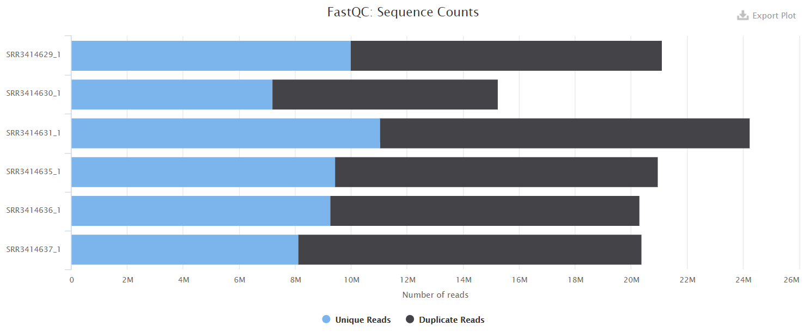
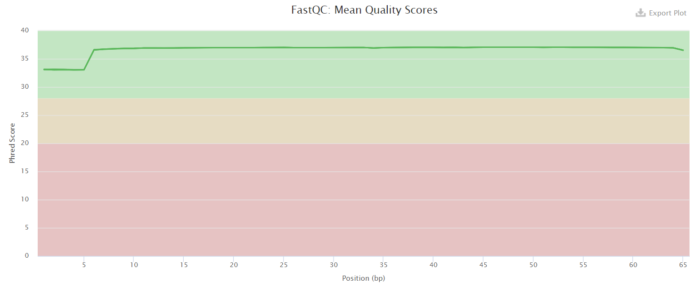
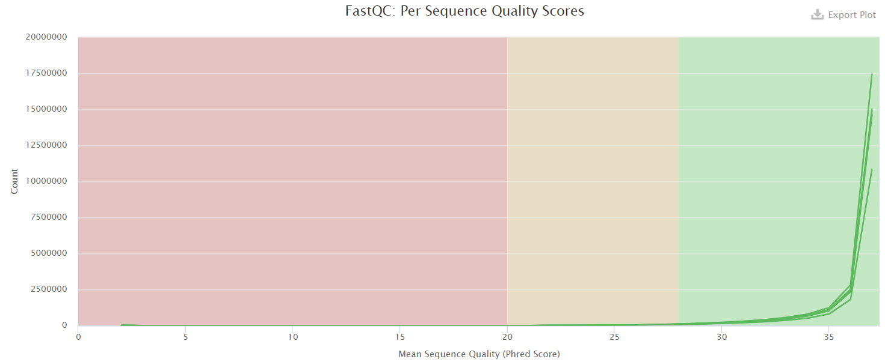
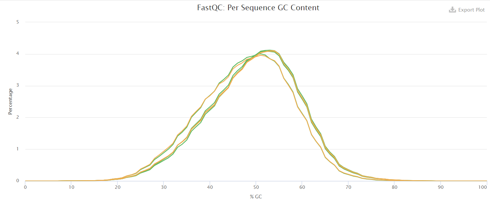
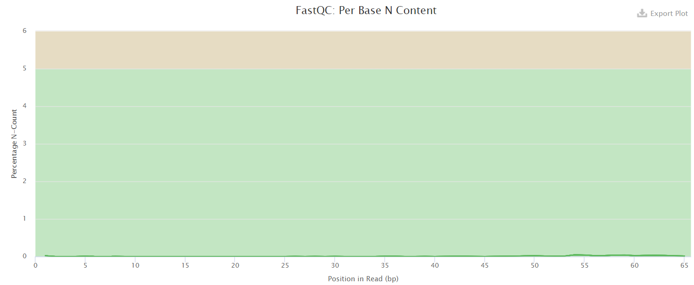
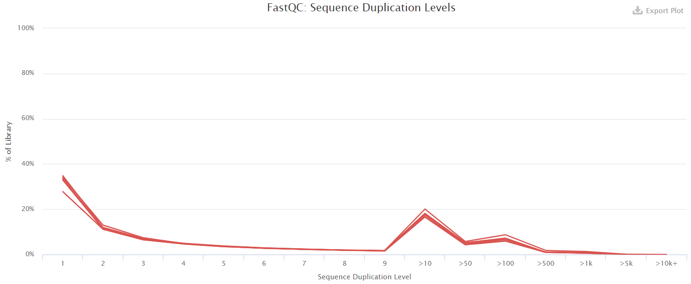
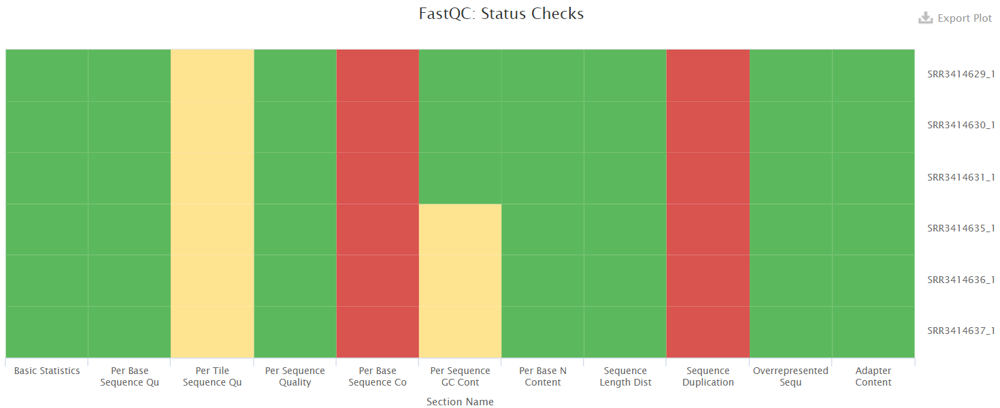

Sample | % Dup |	%	 GC	|	Length	|	%	Failed	|	M	Seqs
-|-|-|-|-|-
SRR3414629 |	52.6% | 49% |	65 bp |	18% |	21.1
SRR3414630	| 52.7% | 47%	| 65 bp |	18% |	15.2
SRR3414631	| 54.5% | 49% |	65 bp |	18% |	24.2
SRR3414635	| 54.9% | 49%	| 65 bp |	18% |	21.0
SRR3414636 |	54.4% | 49%	| 65 bp |	18% |	20.3
SRR3414637 |	60.2% | 47%	| 65 bp |	18% |	20.4

### DESeq2
Sample | Type | Reads number | Aligned reads | Aligned once | Reads per gene
-|-|-|-|-|-
SRR3414629 | reprogramming | 21106089 |	20510113 (97.18%)	|	18375888 (87.06%)  | 16049609
SRR3414630 | reprogramming |	15244711 | 14832680 (97.30%)	|	13186139 (86.50%) |	11465324
SRR3414631 | reprogramming | 24244069 | 23547686 (97.13%) | 20928945 (86.33%) |	18408851
SRR3414635 | control | 20956475 |	20395865 (97.32%)	| 18428317 (87.94%) |	16275997
SRR3414636 | control | 20307147 |	19757059 (97.29%)	| 17825380 (87.78%) |	15757580
SRR3414637 | control | 20385570 |	19847291 (97.36%)	| 17844858 (87.54%) |	15736978

#### MA-plot

#### Тепловая карта

#### Normalized counts для топ-5 генов
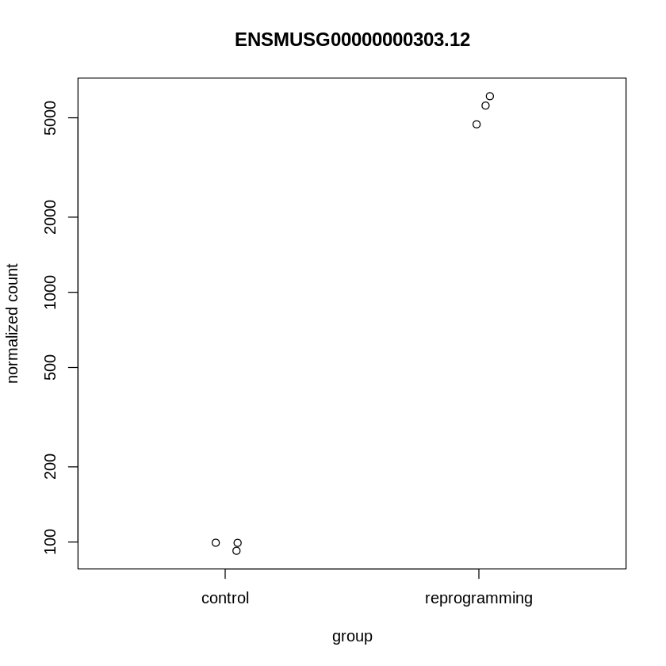

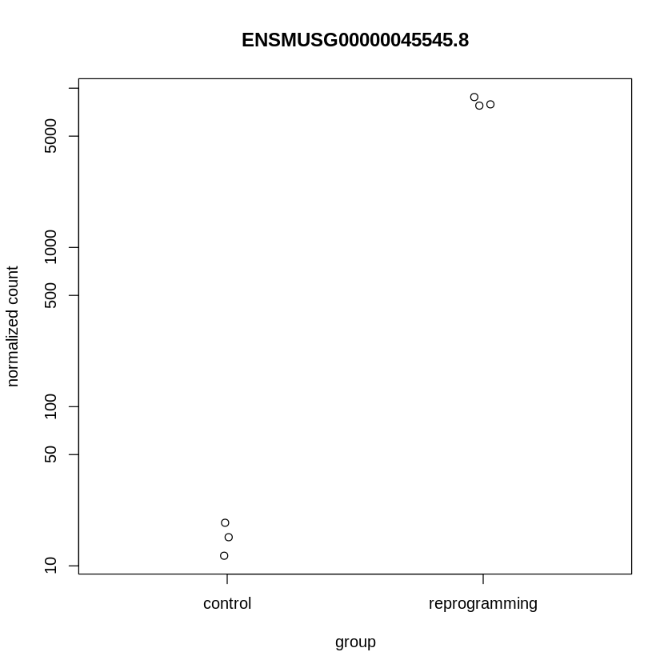
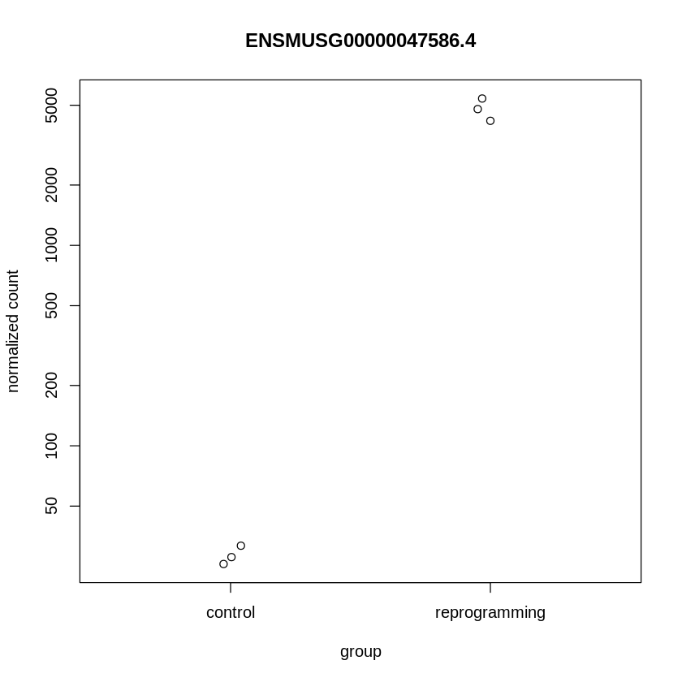
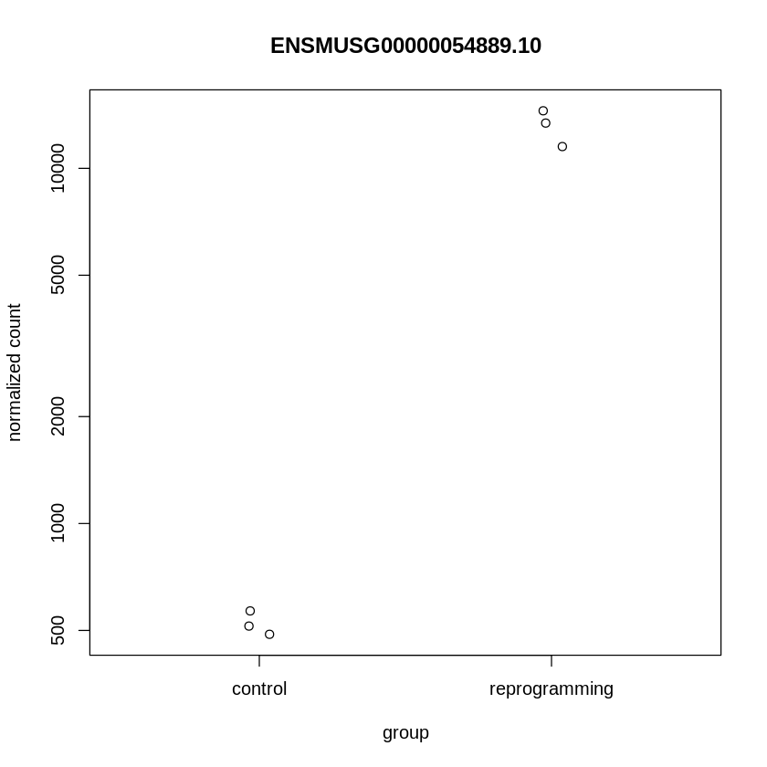
